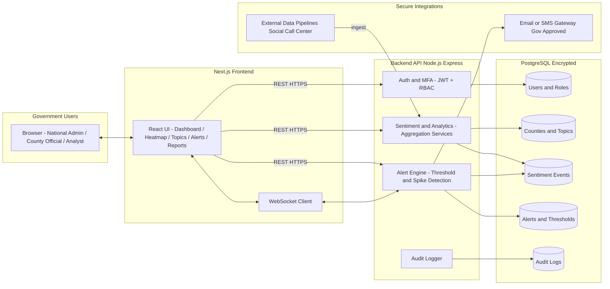

Nyayo Sentinel Dashboard – Early Warning System
================================================

Nyayo Sentinel Dashboard is a secure, production-ready government analytics platform for monitoring and visualizing public sentiment across Kenya. It is designed as an **early warning system** for emerging frustration, negative sentiment, or unrest, with county- and topic-level drill-downs and configurable alerting.

## High-Level Architecture

The system is split into three main layers:

- **Frontend (Next.js + React)**  
  - Responsive, desktop-first dashboard UI  
  - Role-aware navigation and component rendering (Admin, County Official, Analyst)  
  - WebSocket (or polling) client for real-time sentiment and alert updates  
  - PDF/CSV report generation and download

- **Backend API (Node.js + Express + TypeScript)**  
  - Secure REST API with JWT-based auth + MFA challenge/verification  
  - RBAC enforcement middleware (National Admin, County Official, Analyst)  
  - Sentiment ingestion endpoints (from external pipelines or manual inputs)  
  - Analytics aggregation (national overview, county heatmap, topic breakdowns, historical trends)  
  - Alert engine for threshold- and spike-based early warnings  
  - Audit logging for logins, data access, configuration changes, and report exports

- **Data & Infrastructure (PostgreSQL + Docker)**  
  - PostgreSQL with encrypted storage (volume-level + optional column-level crypto)  
  - Strict anonymization: sentiment events never store personal identifiers  
  - Optional air-gapped deployment (no outbound internet, private networks only)  
  - Reverse proxy / TLS termination (e.g. Nginx or government-managed load balancer)

### Architecture Diagram (Logical)



## Data Model Overview

- **User**
  - `id`, `email`, `hashed_password`, `role`, `county_id?`, `mfa_enabled`, `mfa_secret?`, `last_login_at`
- **County**
  - `id`, `name`, `code`, `region`
- **Topic**
  - `id`, `name`, `category` (e.g., Land, Water, Healthcare), `is_active`
- **SentimentEvent**
  - `id`, `county_id`, `topic_id`, `timestamp`, `sentiment_score` (e.g., -1.0 to 1.0), `sentiment_label` (Positive/Neutral/Negative), `source` (e.g., social, call center), `volume_weight`
  - **No personal identifiers stored** (no phone numbers, names, IDs, free-text PII)
- **AlertThreshold**
  - `id`, `county_id?`, `topic_id?`, `metric_type` (e.g., NEGATIVE_PERCENT, SPIKE_FACTOR), `threshold_value`, `severity`, `active`
- **Alert**
  - `id`, `county_id`, `topic_id?`, `severity`, `trigger_type` (threshold/spike), `triggered_at`, `status`, `summary`
- **AuditLog**
  - `id`, `user_id`, `timestamp`, `action` (LOGIN, VIEW_DASHBOARD, EXPORT_REPORT, UPDATE_THRESHOLD, etc.), `resource_type`, `resource_id?`, `metadata` (JSON, non-PII)

## Core Functional Modules

- **Sentiment Overview Dashboard**
  - National sentiment summary (positive/neutral/negative percentages)
  - Real-time sentiment score indicator (rolling window average)
  - Trend charts (daily/weekly/monthly)
  - Top emerging negative topics
  - Active alerts panel

- **County-Level Heatmap**
  - Interactive Kenya map by county with color gradient
  - Hover: county name, sentiment score, top complaint topics, volume
  - Click: drill down to county detail view

- **Topic Analysis**
  - Topic-wise sentiment distribution
  - Bar/pie charts for topic shares and sentiment labels
  - Keyword/topic trend lines
  - Filters: county, date range, topic, sentiment level

- **Early Warning Alerts**
  - Threshold-based (e.g., negative sentiment > X% for Y days)
  - Spike-based (change vs baseline exceeds factor)
  - Alert severity levels: Low, Medium, High, Critical
  - Notification integrations (Email/SMS/internal)
  - Alert history with acknowledgment and resolution tracking

- **Analytics & Reports**
  - Export national or county-level summaries as PDF/CSV
  - Weekly/monthly reports and historical trend analysis
  - Comparative county performance views

## Security & Compliance Design

- **Authentication & MFA**
  - Username/password with strong password policy
  - MFA via TOTP (authenticator app) or OTP (SMS/email via secure gateway)
  - Short-lived access tokens (JWT) + refresh tokens stored securely (HTTP-only cookies)

- **RBAC**
  - `National Admin`: full access across all counties and settings
  - `County Official`: restricted to assigned county data and alerts
  - `Analyst`: read-only analytics across authorized scope
  - Enforcement via middleware on each route and UI-level guards

- **Privacy & Anonymization**
  - No storage of national IDs, phone numbers, names, free-text that could directly identify individuals
  - Aggregated analytics only; raw events are stripped of PII before ingestion
  - Retention policies and purge mechanisms for old sentiment events and logs

- **Encryption**
  - HTTPS/TLS for all traffic in production (via reverse proxy/load balancer)
  - Encrypted volumes for PostgreSQL
  - Optional column-level encryption for sensitive configuration or secrets

- **Audit Logging**
  - Logs for authentication, data access, admin changes, threshold updates, and exports
  - Immutable, append-only design (or periodic export to WORM storage)

- **Kenya Data Protection Act, 2019**
  - Data minimization, purpose limitation, and transparency baked into design
  - Role-based access, strict logging, and no PII storage for sentiment events
  - Support for Data Protection Impact Assessments (DPIA) and subject rights via processes

- **Air-Gapped Deployment**
  - All services deployable in a closed network with no outbound connectivity
  - External notification gateways can be replaced by on-premise SMS/Email gateways
  - Docker-based deployment for reproducibility

## Project Structure 

```text
nyayo-sentinel-dashboard/
  frontend/          # Next.js + React UI
  backend/           # Node.js + Express API
  docker-compose.yml # Frontend, backend, Postgres services
  README.md
```

Subsequent files in this repository implement:

- Secure authentication with MFA hooks and RBAC
- Sentiment ingestion, analytics, and visualization APIs
- Alert logic and notification integration points
- Audit logging and compliance-aligned behaviors

